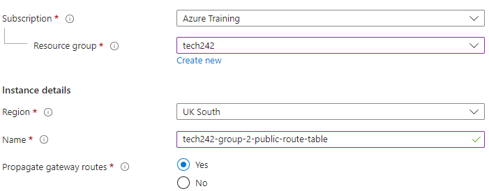

# Route Tables

A route table is a set of rules, often expressed as a list of routes, that determines how network traffic should be directed. These tables are used to make decisions about where to send data packets based on their destination IP addresses. Each route in a route table typically specifies a destination IP address range and the next hop information (the next network device to which the packet should be sent).

Route tables play a crucial role in defining the routing behavior within the network.
In the context of our project, we want to create a public route table to dictate routes for internet-bound traffic.

## Creating a Public Route Table

* When creating a route table, it's important to give it a descriptive name, make sure it is created in the correct resource group, choose an appropriate region and decide whether to propagate gateway routes or not.
* The decision to propagate gateway routes will depend on the project's specific network architecture and requirements. Propagating gateway routes essentially means including routes to on-premises networks or the internet in the route table.

