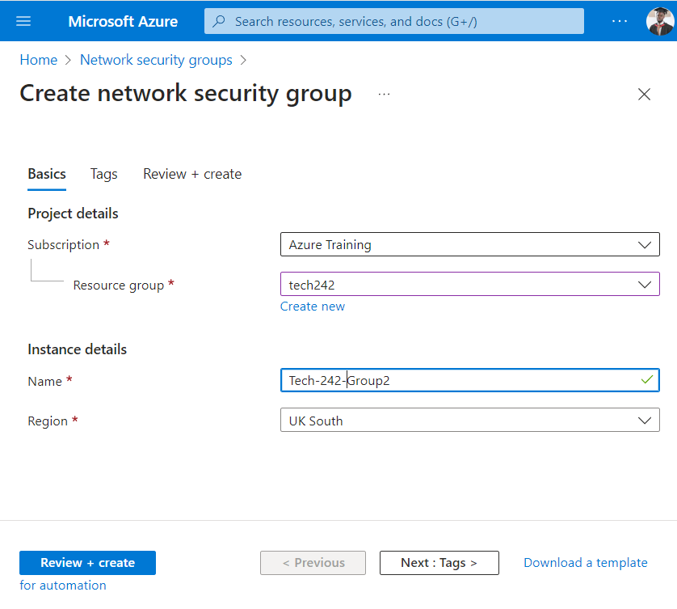
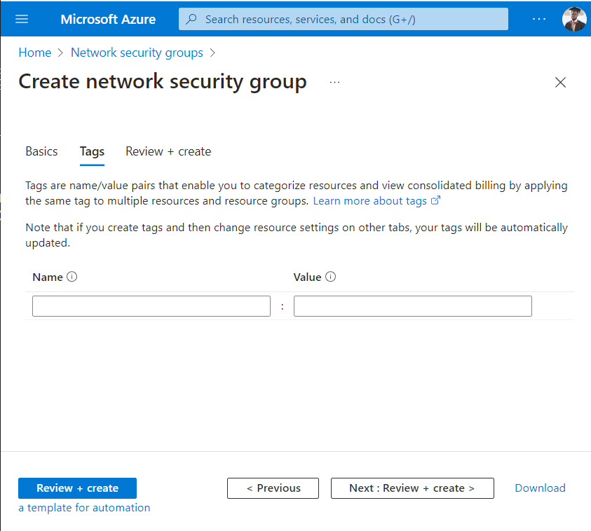
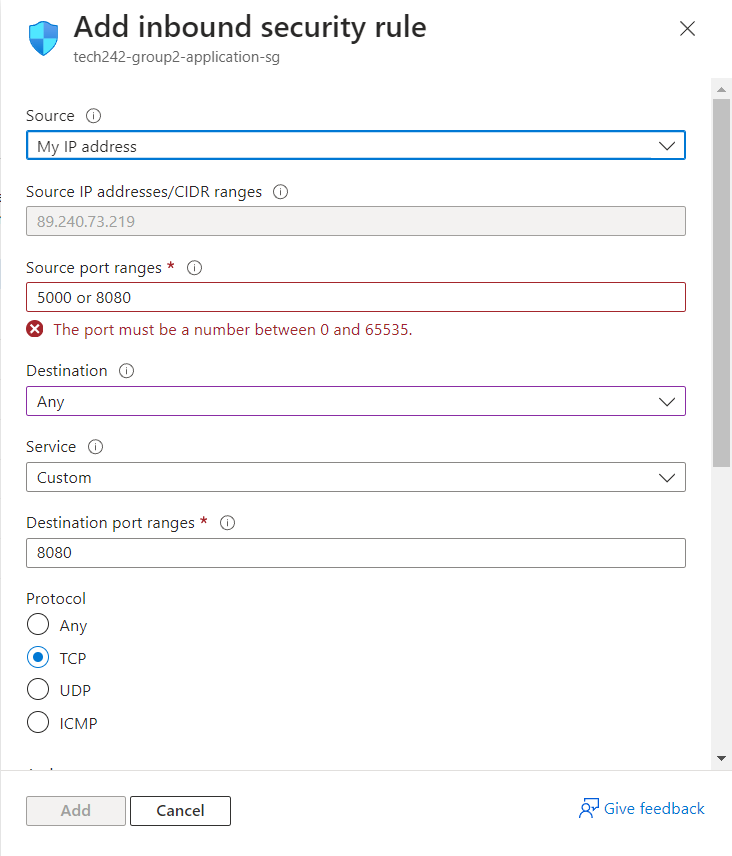
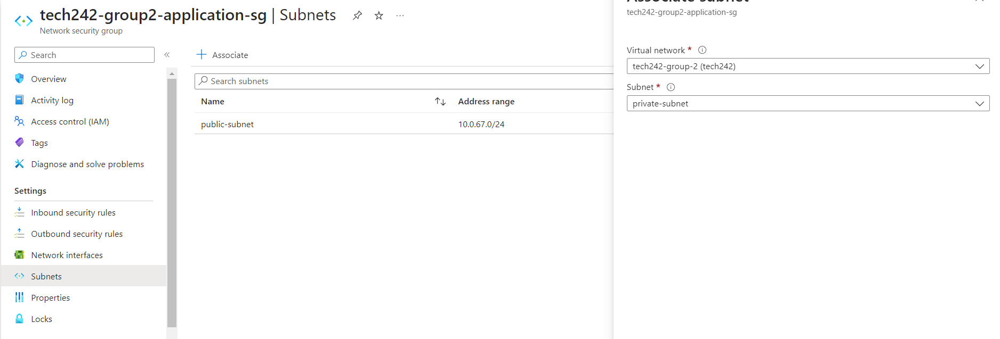

# Creating Security Groups
The role of a security group is to limit any machines from accessing a machine with unauthorised access. 
There are 2 steps to achieving this:

- [Creating Security Groups](#creating-security-groups)
  - [1. Creating a Scurity group](#1-creating-a-scurity-group)
  - [2. Initializing a security group](#2-initializing-a-security-group)
        - [Inbound rules:](#inbound-rules)
        - [Subnet Association](#subnet-association)

## 1. Creating a Scurity group
1. To create a Security group, yougo to the home page of Azure and use the search bar to search, " Network Security groups"

2. On That page, click on 'Create'

3. Your page should then look like the following with all of the neccessary details filled out in the required boxes

4. To fill out the tags, you can use 'name' in the box labelled 'Name' and 'Tech-242-SG' in the box labelled 'Tag'

5. Now you can press 'Review + Create' to comlete the creation of our security group

## 2. Initializing a security group
1. To initialize our security group, we can now use the search bar to find security groups and find then use the resulting page to find the security group that we have created by its name
2. The follwoing photograph shows the options available for our security group that will determine the specific port that will be open to external machines.
   - Inbound rules Insure that only certain ports can be accessed by other machines
   - Outbound rules insure tthat only certain ports can be used to send data remotely
   - Network Inteerfaces show all of the devices that will have the same inbound and outbound rules stated by this security group.
   - Subnets can be used to state the specific IP address that are allowed to access each virtual machine within a network.

Many of these are important things that should be initialized for a security group.

##### Inbound rules:

Please note that the rules aren't strict but unique to my project. Port 5000 was going to be a rule that allowed for reverse proxying. Port 8080 would allow for machine access through HTTP.The database security group would use ports 3306 to allow its own data to be accessed.

##### Subnet Association

Once you have initiallized the the inbound rules, you can now look at the the subnets and associate them with a virtual network and make it a private or public subnet. It is common practice to make database private and then an application public.

With the other rules, the default settings have been used for the purpose of this project.
