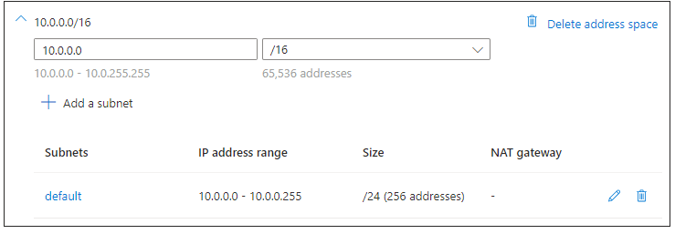
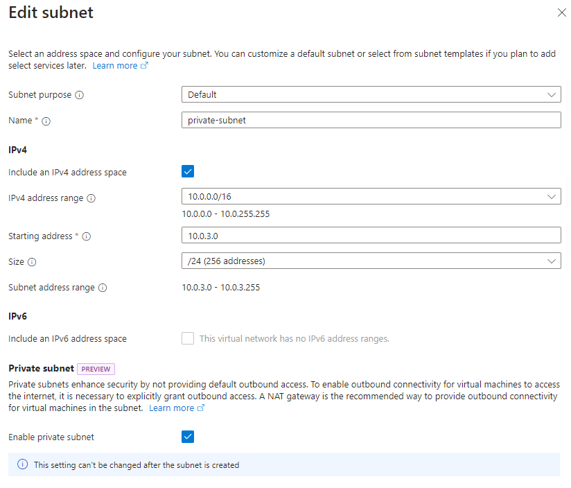
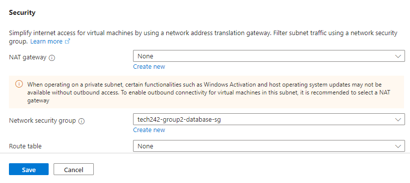
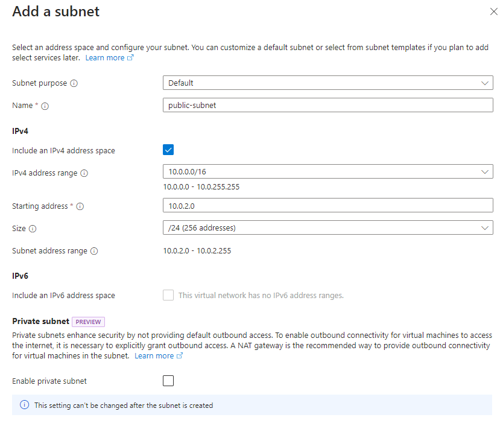
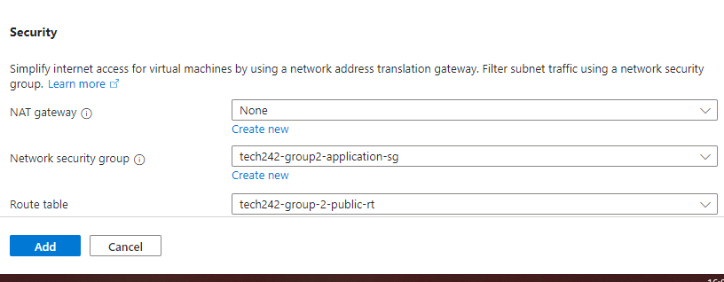

# Subnets

Subnets, short for subnetworks, are divisions within a larger network that enable better organization, segmentation, and management of network resources. 

When we create a virtual network, we typically divide it into subnets. Each subnet is identified by its own unique CIDR (Classless Inter-Domain Routing) address range. Azure Virtual Networks allows us to deploy resources such as virtual machines, databases, and other services into these subnets.

In summary, subnets are a fundamental concept in networking that helps in organizing and managing network resources efficiently, enhancing security, and facilitating more effective routing of network traffic.

## Creating Subnets

Unlike in Amazon Web Services, where we have to create our subnets separately, in Azure we can create our subnets directly when we set up our virtual network.

## Private Subnet

Private subnets are typically used for internal resources that don't need direct exposure to the internet. Resources within private subnets can communicate with each other and with resources in other subnets, but they require a gateway or a Network Address Translation (NAT) device to communicate with the internet.

* For this project, we want to create a private subnet to host our database virtual machine.

* We can also add the desired security group to the subnet.
* Also, we will not need to add a routing table, as there is a default routing table that deals with internal communication within the virtual network.

## Public Subnet

A public subnet is a subnet within a network that uses public IP addresses. Public IP addresses are routable on the global Internet, and devices or resources assigned public IP addresses can be accessed directly from the internet. Public subnets are often used for resources that need to be accessible from the internet, such as web servers, load balancers, or other services that require external communication.

* For this project, we want to create a public subnet to host our application virtual machine as it will be accessible from the internet.

* Like for the private subnet, we can add the desired security group to the sybnet.
* For the public subnet, we will need to add a public routing table to dictate routes for internet-bound traffic.

