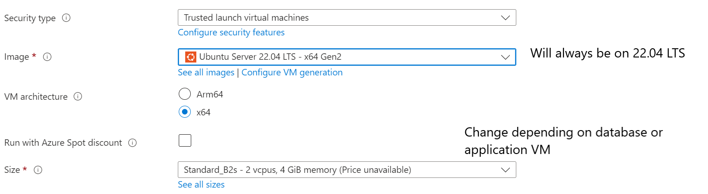
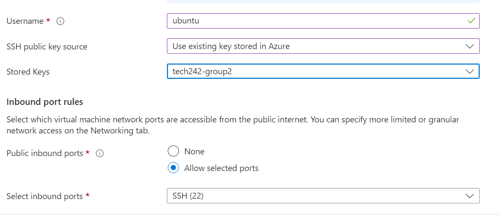
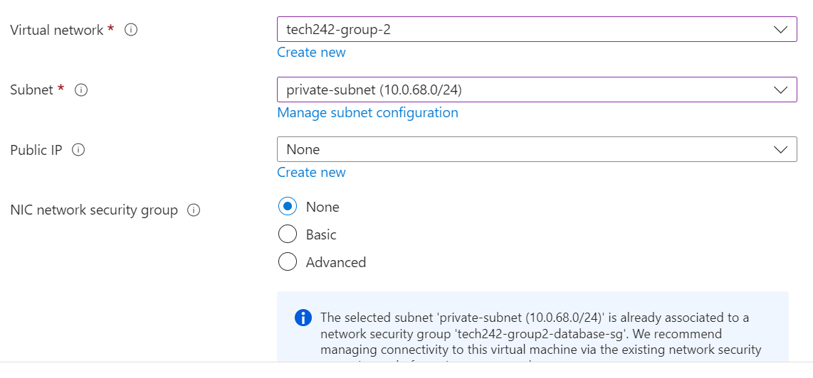
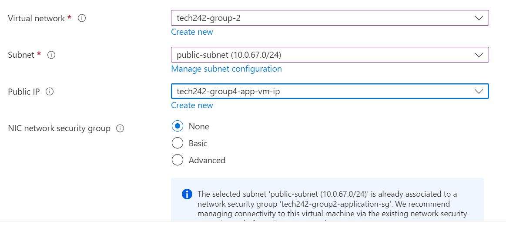
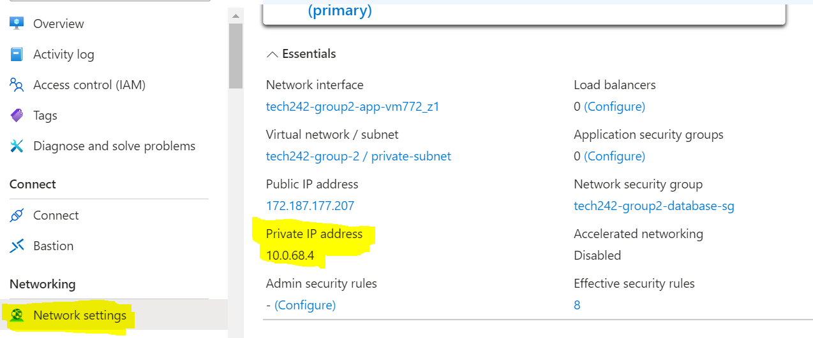

# Creating Virtual Machines

When creating virtual machines, it is important to consider creating a virtual machine with the right configurations to ensure that our code can function properly. The following app code for our "world project" will have the configurations:

## General Configurations for both VMs:
* Any Azure managed Private Key (ensure you have a local copy in your .ssh folder)
* Any naming convention (as long as you can follow - we will name the ones for convenience sake)
* Any availability zone as long as both VMs are within the same region. (Recommended UK south)
* Virtual Network - under our created virtual network
* Select Inbound Ports: Allow SSH 22
* If blindly following tutorial, change ```Username: azureuser``` to ```Username: ubuntu```

**Database Virtual Machine:**
* Name: tech242-group2-database-vm
* Image: Ubuntu 22.04 LS
* Size: B1
* Subnet: Private Subnet
* NIC Security Group: Private Subnet Security Group (group2-database-sg)
* No Public IP address
Advanced > Enable User Data [Depending on automation phase]

**Application Virtual Machine:**
* Name: tech242-group2-application-vm
* Ubuntu 22.04 LS
* Size: B2
* Subnet: Public Subnet
* NIC Security Group: Public Subnet Security Group (group2-application-sg)
* Public IP address
Advanced > Enable User Data [Depending on automation phase]

Note that the advanced user data should be configured depending on what stage of automation you would like to develop first - if you would like to go slowly leave this disabled, but if you would like to go hands in with user-data, enable this option and paste the created app code later.

## Screenshots of configurations


**Note that you may not be able to SSH immediately if your sec. group has not been configured to allow SSH from your IP**
</br>


**Database VM configuration**
</br>


**Application VM configuration**

## Noting Database private IP address
It will be convenient to take note of the private IP address of the Database virtual machines as it will be repeatedly used within our Commands, BASH scripts and User Data scripts.
This can be found under Virtual Machine > [Your Database VM] > Network Settings > Private IP Address




