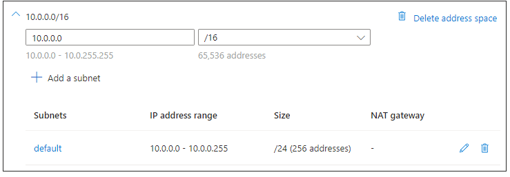
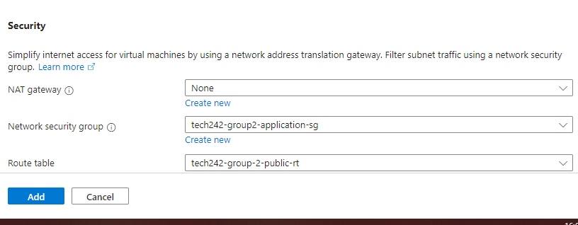

# Azure Virtual Network

In Microsoft Azure, a virtual network (VNet) is a fundamental building block that allows us to securely connect and isolate resources within the Azure cloud. It provides a way for us to create private, isolated, and segmented network environments in the cloud.

Some of its key features include:

* Subnets - [Subnets](../create-subnets)
* Private IP Addressing
* Network Security Groups (NSGs) - [Network Security Groups](../create-security-groups)
* Routing Tables - [Routing Tables](../create-public-rt)
* Amongst others: https://aviatrix.com/learn-center/cloud-networking/azure-networking-fundamentals/#:~:text=Key%20components%20of%20Azure%20VNets%2C%20include%3A&text=Network%20Security%20Groups%20(NSG)%3A,Balancer%2C%20and%20Azure%20Application%20Gateway.

## Creating Virtual Networks

## Sections

### Basics 

* When creating a Virtual Network, it's important to set up a descriptive name, select the correct resource group and appropriate region.

### Security 

* In our specific case, we do not need to worry about Azure Bastion, Azure Firewall or Azure DDoS Network Protection.

### IP Adresses

The term "address space" refers to the range of IP addresses that we define for our virtual network. When we create a virtual network, we specify an address space to define the range of private IP addresses that can be used by resources within that network.

The address space is typically expressed in CIDR (Classless Inter-Domain Routing) notation, which represents the range of IP addresses using a combination of network address and subnet mask. For example, an address space of 10.0.0.0/16 indicates a range of IP addresses from 10.0.0.0 to 10.0.255.255.

In this particular case, we are selecting 10.0.0.0/16 which will allow us to have 65,536 addresses available.

### Subnets

Unlike in Amazon Web Services, where we have to create our subnets separately, in Azure we can create our subnets directly when we set up our virtual network.

#### Private Subnet

Private subnets are typically used for internal resources that don't need direct exposure to the internet. Resources within private subnets can communicate with each other and with resources in other subnets, but they require a gateway or a Network Address Translation (NAT) device to communicate with the internet.

* For this project, we want to create a private subnet to host our database virtual machine.

* We can also add the desired security group to the subnet.
* Also, we will not need to add a routing table, as there is a default routing table that deals with internal communication within the virtual network.

#### Public Subnet

A public subnet is a subnet within a network that uses public IP addresses. Public IP addresses are routable on the global Internet, and devices or resources assigned public IP addresses can be accessed directly from the internet. Public subnets are often used for resources that need to be accessible from the internet, such as web servers, load balancers, or other services that require external communication.

* For this project, we want to create a public subnet to host our application virtual machine as it will be accessible from the internet.

* Like for the private subnet, we can add the desired security group to the sybnet.
* For the public subnet, we will need to add a public routing table to dictate routes for internet-bound traffic.

